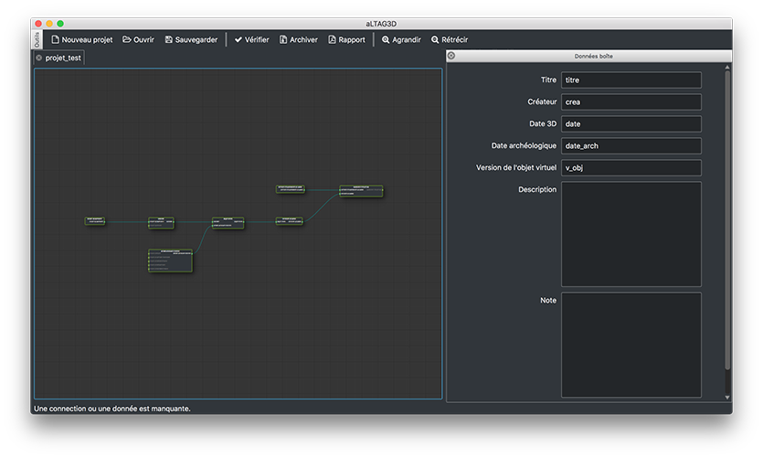
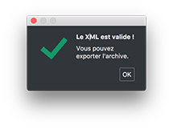
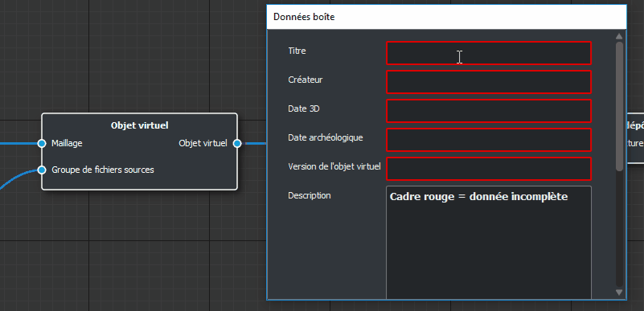

Interfaces
==========

Accueil
-------

La page d'accueil de l'application vous permet de créer/ouvrir un projet. Elle
garde également une trace de vos projets ouverts récemment afin de faciliter
leurs réouvertures.

La partie droite de la page affiche des informations concernant la version de
l'application et du :ref:`XSD <xsd>` ainsi que des **Nouveautés** issues du Forum_ du
Consortium 3D.

En case de mise à jour nécessaire, vous trouverez dans cette partie droite un
message vous proposant le passage à la version supérieure. Un clic sur le message
suffit pour déclencher la mise à jour dans le cas du XSD, pour l'application la
réinstallation du logiciel est nécessaire.

Fenêtre principale
------------------

L'ouverture d'un projet entraîne l'ouverture de la fenêtre des boîtes ainsi que
la création de l'arbre minimal, c'est à dire le plus petit ensemble de boîtes
nécessaires à la création d'une archive correcte.

Pour compléter cet arbre, vous pouvez :

- Créer une nouvelle boîte en cliquant/glissant depuis un nœud d'entrée d'une des boîtes existantes. :ref:`Exemple <exemple-clic-g>`.
- Ajouter des données aux boîtes en double-cliquant sur l'une d'entre elles pour ouvrir le panneau de remplissage. :ref:`Exemple <exemple-d-clic>`.

.. attention::
   Certaines boîtes ne peuvent pas avoir plus d'un seul « enfant ».

.. _exemple-clic-g:

  Exemple de création de boîtes

**Boutons de l'interface :**

+----------------+------------------------------------------------------------------------------------------------------------------------------------+
| **Bouton**     | **Action**                                                                                                                         |
+----------------+------------------------------------------------------------------------------------------------------------------------------------+
| Nouveau projet | Permet de créer un nouveau projet dans un nouvel onglet                                                                            |
+----------------+------------------------------------------------------------------------------------------------------------------------------------+
| Ouvrir         | Permet d'ouvrir un projet dans un nouvel onglet                                                                                    |
+----------------+------------------------------------------------------------------------------------------------------------------------------------+
| Sauvegarder    | Permet de sauvegarder le projet en cours, si le projet n'a jamais été sauvegardé le bouton agira comme l'option "sauvegarder-sous" |
+----------------+------------------------------------------------------------------------------------------------------------------------------------+
| Vérifier       | Permet de vérifier si l'arbre est valide et permettra de générer une archive correcte                                              |
+----------------+------------------------------------------------------------------------------------------------------------------------------------+
| Archiver       | Permet d'ouvrir l'utilitaire d'archivage (Cette option n'est disponible que si le projet a été correctement vérifié)               |
+----------------+------------------------------------------------------------------------------------------------------------------------------------+
| Rapport        | Permet de générer le rapport d'archivage                                                                                           |
+----------------+------------------------------------------------------------------------------------------------------------------------------------+
| Agrandir       | Permet de zoomer l'interface boîtes                                                                                                |
+----------------+------------------------------------------------------------------------------------------------------------------------------------+
| Rétrécir       | Permet de dé-zoomer l'interface boîtes                                                                                             |
+----------------+------------------------------------------------------------------------------------------------------------------------------------+

Fenêtre des « Données boîtes »
------------------------------

La fenêtre de remplissage se présente sous la forme d'un formulaire à remplir.
Les données obligatoires sont encadrées en rouge. La sauvegarde des données (et
non pas du projet !) est automatique et s'effectue lors de chacune des modifications
apportées à une donnée. La fenêtre se situe sur la droite de l'application, elle
est détachable et déplaçable.

  La validation est passée !

Le remplissage de certaines données est nécessaire pour l'obtention d'une archive
correcte. Une boîte est *valide* si la couleur de son contour est verte. Lors
de l'utilisation du bouton **Valider**, le contour d'une boîte peut devenir rouge
ce qui permet de trouver plus facilement la boîte bloquant l'archivage.

.. _exemple-d-clic:

  Exemple de validation des données

**Cas particulier des boîtes « fichiers » :**

Le panier de fichiers est une fenêtre de remplissage des données un peu
particulière. Il faut en effet glisser un fichier (ou plusieurs, si la boîte
l'autorise) dans le cadre pour afficher les données à compléter. Dès que le
fichier est lâché, si un :ref:`plugin <plugins>` correspondant à l'extension du fichier est
installé, alors les données seront remplies de manière automatique.

.. figure:: _static/images/nodes_drop.gif
  :align: center

  Exemple de remplissage d'une boîte fichier

.. _Forum: http://forum3d.huma-num.fr/
