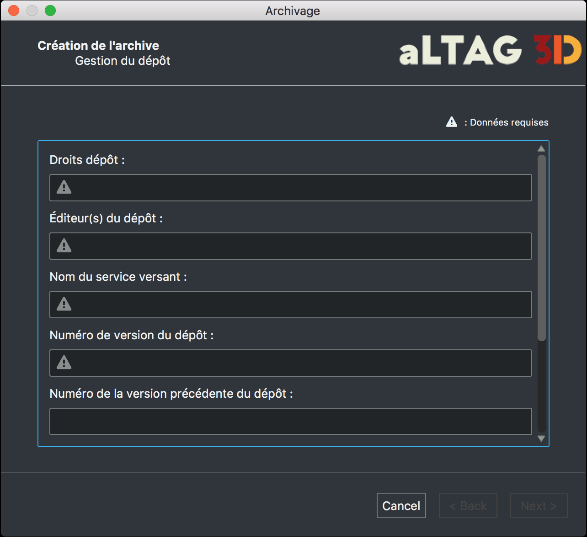

Génération d'une archive
========================

L'option **Archiver** permet de générer les fichiers nécessaires à l'archivage
de votre projet et à les placer de manière hiérarchisé dans un dossier.

Afin de générer ces fichiers, un dernier formulaire doit être rempli. Il permet
par exemple à aLTAG3D de compléter le fichier SIP.xml requis pour un archivage
sur la plate-forme du CINES.

.. attention::
   Cette procédure copie l'ensemble des fichiers inclus dans votre projet aLTAG3D
   et risque donc de prendre une place conséquente sur votre disque.

  Formulaire d'archivage
